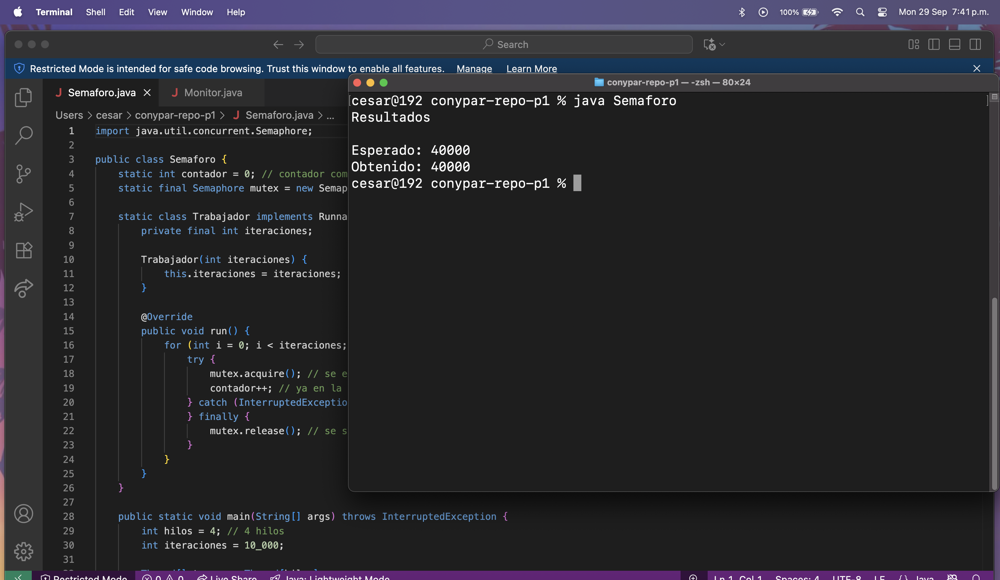
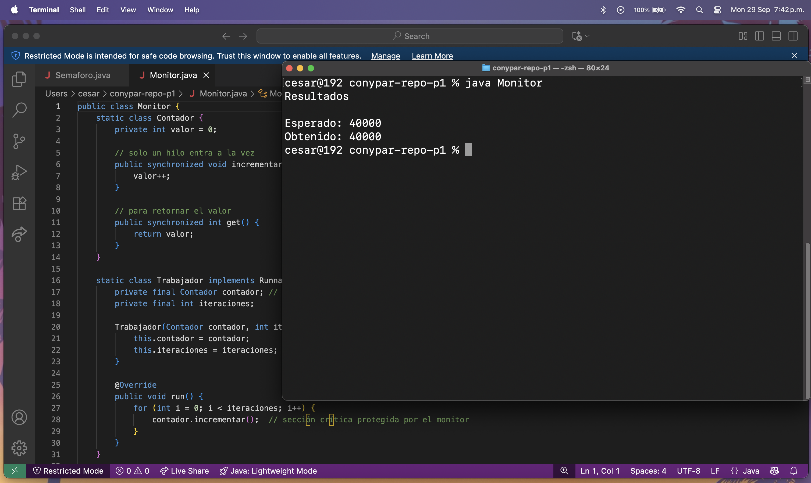

# Reporte. César Antonio Ix Sánchez.
## Introducción al problema de la condición de carrera
En la programación concurrente, un problema recurrente y crítico es la condición de carrera. Esta ocurre cuando dos o más hilos acceden y manipulan un recurso compartido al mismo tiempo, y el resultado final depende del orden no determinista 
en que se ejecutan las operaciones. La condición de carrera no es siempre evidente, pues puede aparecer únicamente bajo ciertas intercalaciones de instrucciones, lo que hace que se manifieste de forma intermitente y difícil de depurar.
Un ejemplo clásico es el incremento de una variable compartida. Si un hilo lee el valor y está a punto de sumarle uno, pero justo en ese momento otro hilo también lee el mismo valor, ambos terminarán escribiendo un resultado incorrecto.
Esto sucede porque las operaciones de lectura, suma y escritura no son atómicas, y sin protección adecuada el valor compartido pierde coherencia. La presencia de condiciones de carrera puede provocar errores lógicos, resultados inconsistentes, 
bloqueos inesperados o incluso fallos de seguridad en un sistema. Debido a esto, en entornos multihilo es fundamental garantizar exclusión mutua, es decir, asegurar que solo un hilo a la vez pueda entrar en la sección crítica de código que 
accede a los recursos compartidos. Para resolver este problema existen herramientas de sincronización como semáforos y monitores, que permiten a los programadores coordinar la ejecución de los hilos y evitar la corrupción de datos, ofreciendo 
así programas concurrentes más robustos y confiables.

## Explicación breve del funcionamiento del semáforos y monitores
Los semáforos y los monitores son dos mecanismos ampliamente utilizados para manejar la concurrencia en la programación. Ambos persiguen el mismo objetivo: evitar conflictos derivados de accesos simultáneos a recursos compartidos, pero su 
enfoque es distinto. Un semáforo es esencialmente una variable entera protegida, que se manipula a través de dos operaciones atómicas: wait (o P) y signal (o V). En el caso de los semáforos binarios, se comportan como un candado, permitiendo 
que solo un hilo a la vez acceda a la sección crítica. En los semáforos contadores, además de regular el acceso exclusivo, pueden controlar la disponibilidad de múltiples recursos, como en un buffer acotado. Su gran ventaja es la flexibilidad, 
aunque el programador debe ser cuidadoso para evitar problemas como deadlocks o inanición. Por otro lado, los monitores encapsulan tanto los datos compartidos como los métodos que los manipulan, y garantizan que únicamente un hilo pueda 
ejecutar una operación monitoreada a la vez. En Java, esto se logra con la palabra clave synchronized, junto con los métodos wait() y notify()/notifyAll() para la coordinación entre hilos. Los monitores simplifican la programación, porque la 
exclusión mutua está implícita en la estructura del lenguaje, reduciendo así los errores de implementación que suelen aparecer con semáforos.
En otras palabras, los semáforos ofrecen control más granular, pero requieren disciplina, mientras que los monitores brindan una abstracción más segura y fácil de usar para manejar concurrencia.

## Capturas de pantalla que muestren la ejecución del programa con semáforo y con monitor

## Conclusiones sobre la importancia de la exclusión mutua con semáforos y monitores en la programación concurrente
La práctica desarrollada demuestra de forma clara la importancia de la exclusión mutua en la programación concurrente. Sin un control adecuado, los hilos pueden interferir entre sí y provocar condiciones de carrera, resultando en cálculos 
incorrectos o comportamientos impredecibles. Tanto los semáforos como los monitores ofrecen soluciones efectivas a este problema, aunque desde enfoques distintos. El uso de semáforos permite un control explícito y flexible sobre el acceso a 
los recursos, siendo útiles en situaciones donde se necesita administrar tanto exclusión mutua como la disponibilidad de múltiples instancias de un recurso. No obstante, su manejo requiere más atención, ya que un mal uso puede introducir 
problemas como bloqueos mutuos. En cambio, los monitores simplifican el desarrollo al integrar la sincronización dentro de la propia estructura del lenguaje, reduciendo errores y ofreciendo un enfoque más intuitivo para el programador. Esto 
los hace especialmente útiles cuando se desea claridad y seguridad en el manejo de la concurrencia. Para concluir, comprender y aplicar adecuadamente ambos mecanismos es esencial para desarrollar software concurrente confiable. 
La exclusión mutua no es un detalle opcional, sino un requisito fundamental para garantizar integridad de datos, estabilidad en la ejecución y confianza en el resultado final de los programas multihilo.
